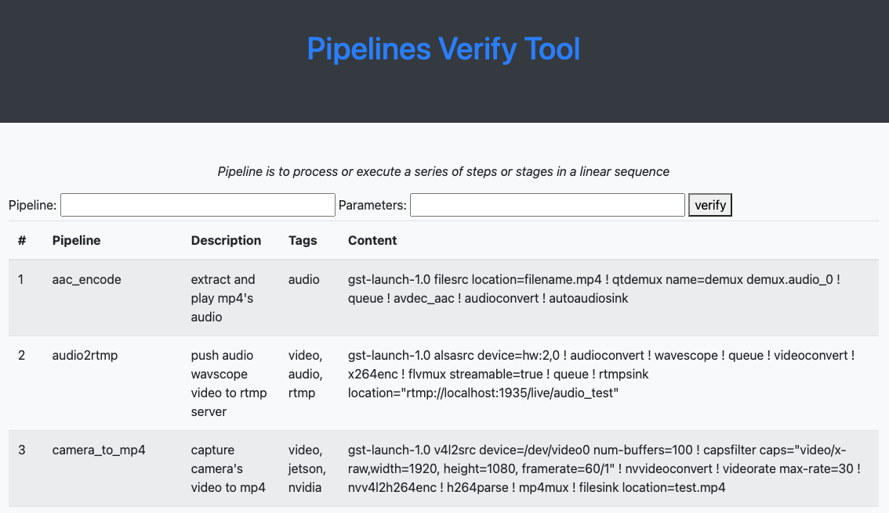

# GStreamer Pipeline Verifier

Verifier of GStreamer Pipeline

## Overview

GStreamer 作为一个多媒体框架和软件库, 其最大的魅力在于它丰富的功能, 强大的灵活性和扩展性.
它对管道模式的妙用让人叹为观止.

GStreamer 创建好元件(GstElement), 设置好属性, 并逐个加入管道 (pipeline), 将它们连接到一起, 设置好状态(PLAYING state), 多媒体数据 (GstBuffer) 就会流经这些元件, 每个元件就可以对多媒体数据进行处理.

GStreamer 支持多种媒体处理组件，包括简单的音频播放、音频和视频播放、录制、流媒体和编辑。
管道设计是创建多种类型的多媒体应用程序的基础，例如视频编辑器、转码器、流媒体广播器和媒体播放器。

这个工具的目的就是为了验证各个管道是否有效, 从功能上与 gst-launch-1.0 有点重复, 不同之处在于采用 yaml 方式存贮和管理 pipeline 的定义, 自己解析和使用 GStreamer C API 来构建和运行管道.

GStreamer 可以完成如下工作

* Audio/Video decode
* Audio/Video encode
* Audio/Video stream capture
* Audio/Video playback
* Audio/Video streaming
* Audio/Video format conversion
* Audio resample
* Video scaling
* Video Cropping
* Video transcode
* Video Rotation
* Video Composition
* ...

基于 GStreamer 这样扩展出来的 DeepStream 可以做更加深入的视频分析和图像识别 

## Usage

```sh
./bin/gst-pipeline-verifier -p <pipeline_name> [-f <config_file>] [-v] [-l] [-w web_port]
```
* -p <pipeline_name> : specify pipeline name that want to verify
                       the detailed pipeline configuration refers to config_file

* -f <config_file> : specify configuration file, it is ./etc/config.yaml by default

* -l : list the pipelines in configuration file

* -v : print current version

* -w : specify web port, default is 9090



## Example

```sh

# print usage
./bin/gst-pipeline-verify -h

# start web console to execute a pipeline
./bin/gst-pipeline-verify -w 9090

# list all pre-defined pipeline
./bin/gst-pipeline-verify -l -a

# execute specified pipeline
./bin/gst-pipeline-verify -p pipeline_test

# play a mp4 file by pipeline mp4_play
./bin/gst-pipeline-verify -p mp4_play

# check the mp4 playback pipeline as gst-launch format
./bin/gst-pipeline-verify -p mp4_play

# run pipeline 'wav_scope_test' within aonther config file
./bin/gst-pipeline-verify -f ./etc/audio.yaml -p wav_scope_test
```


## Environment

### Ubuntu

run the below command to intall gstreamer on ubuntu

```
sudo apt-get install -y build-essential \
cmake \
gstreamer1.0-tools \
libgstreamer1.0-dev \
libglib2.0-dev \
gstreamer1.0-nice \
gstreamer1.0-plugins-bad \
gstreamer1.0-plugins-ugly \
gstreamer1.0-plugins-good \
libgstreamer-plugins-bad1.0-dev \
gstreamer1.0-plugins-base-apps \
libfmt-dev \
libspdlog-dev \
libyaml-cpp-dev \
libjson-glib-dev \
libgtest-dev

```

for MACOS, run similar commands by brew, but suggest downloading package from gstream site

```sh
brew install gstreamer

brew install googletest
```


for ubuntu, the google test library may not be found

```sh
sudo apt-get install libgtest-dev
cd /usr/src/gtest
sudo cmake .
sudo cmake --build . --target install

```

### SRS for stream publishing and subscrbing

* start SRS by docker

```sh
export CANDIDATE="192.168.0.108"
sudo docker run --rm --env CANDIDATE=$CANDIDATE \
  -p 1935:1935 -p 1975:8080 -p 1985:1985 -p 1995:8000/udp \
  registry.cn-hangzhou.aliyuncs.com/ossrs/srs:5 \
  objs/srs -c conf/rtmp2rtc.conf
```

* push local video stream from mp4 to rtmp

```
gst-launch-1.0 -vv filesrc location=material/talk.mp4 \
! decodebin \
! videoconvert ! identity drop-allocation=1 \
! x264enc tune=zerolatency ! flvmux streamable=true \
! rtmpsink location='rtmp://192.168.0.108:1935/live/waltertest'
```

* or run the C++ program

```
./build-with-vcpkg.sh
./bin/gst-pipeline-verify -f ./etc/config.yaml -p pipeline_test_rtmp
```


## build source code by cmake
* install dependent libraries

```sh
sudo apt-get install -y \
gstreamer1.0-tools \
libgstreamer1.0-dev \
libglib2.0-dev \
gstreamer1.0-nice \
gstreamer1.0-plugins-bad \
gstreamer1.0-plugins-ugly \
gstreamer1.0-plugins-good \
libgstreamer-plugins-bad1.0-dev \
gstreamer1.0-plugins-base-apps \
libfmt-dev \
libspdlog-dev \
libyaml-cpp-dev \
libgtest-dev \
libsoup2.4-dev \
libjson-glib-dev
```

* install civetweb 
(refer to https://github.com/civetweb/civetweb/blob/master/docs/Installing.md)

```sh
wget https://github.com/civetweb/civetweb/archive/refs/tags/v1.16.tar.gz
tar xvfz v1.16.tar.gz
cd civetweb-1.16
make
make install
```

* build source code

```sh
mkdir -p build
cd build
cmake ..
make
```

### use vcpkg

* if you have not install vcpkg, please install it first

```
git clone https://github.com/Microsoft/vcpkg.git
cd vcpkg
./bootstrap-vcpkg.sh
./vcpkg integrate install
./vcpkg install spdlog
./vcpkg install fmt
./vcpkg install yaml-cpp
./vcpkg install civetweb
```

* build with dependencies by vcpkg

```
./build-with-vcpkg.sh
```

### use conan

* if you have not install conan, please install it first
```
python3 -m venv venv
source venv/bin/activate
pip install conan
conan profile detect --force
```

* create or update [conanfile.txt](conanfile.txt) for dependencies
  
* then run the following script to build
  
```
./build-with-conan.sh

```


